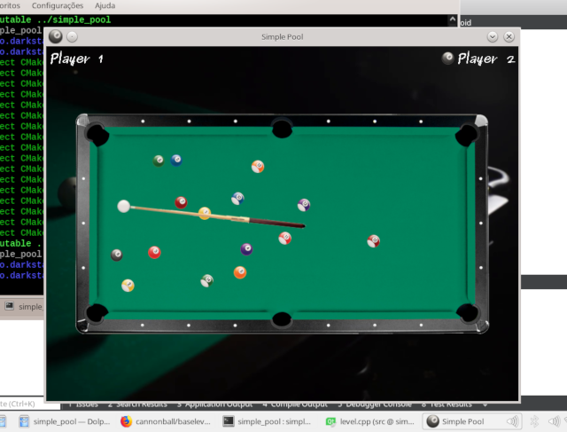

# Simple Pool

This is a simple 2D billiards game made with C++ and SDL2

# Requirements
  - C++14
  
  - SDL2
  
  - SDL2_image
  
  - SDL2_ttf
  
  - SDL2_mixer
  
# Build and Run
    mkdir -p build
    cd build
    cmake ..
    make
    cd ..
    ./simple_pool

